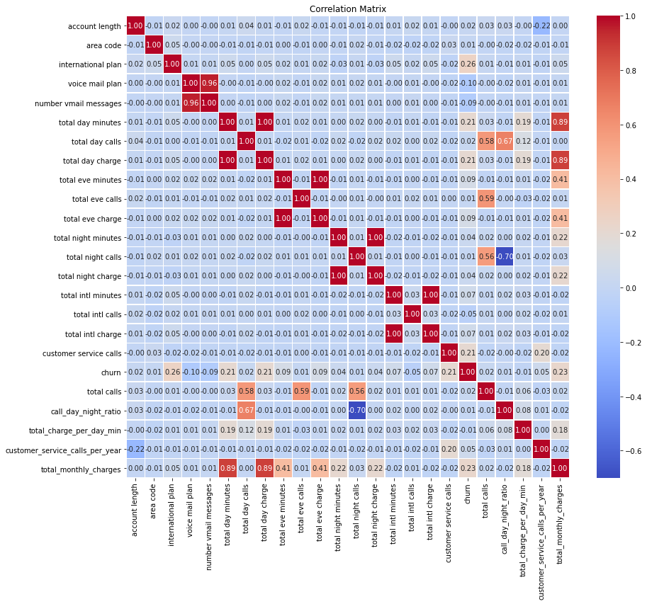
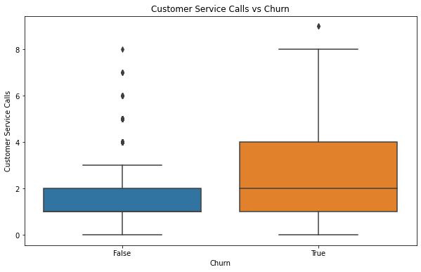
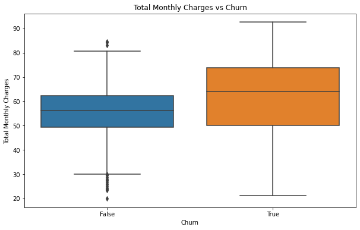
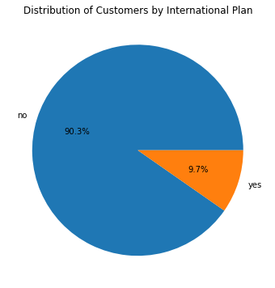
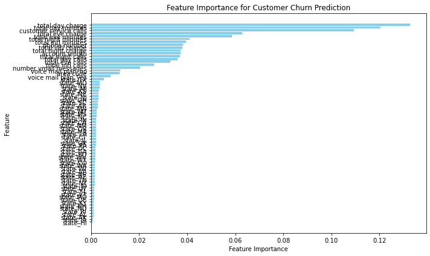

# Customer Churn Prediction

## Overview

This project aims to predict customer churn using various machine learning models. It includes data preprocessing, exploratory data analysis, feature engineering, model training, evaluation, and iteration for improvement.

## Data 

The dataset includes customer information such as:

- Account length
- Area code
- International plan
- Voice mail plan
- Various call and charge metrics
- Customer service call counts
- Churn status

## Exploratory Data Analysis (EDA)

### Correlation Heatmap

A heatmap was created to visualize the correlation between features. High correlations (red) indicate strong relationships between features. For instance, `total monthly charges` and `total day minutes` showed a strong positive correlation.

### Boxplots

Boxplots indicated that higher customer service call counts and total monthly charges are associated with higher churn rates. Outliers in these plots suggest significant dissatisfaction leading to churn.

- **Customer Service Calls vs Churn:**

- **Total Monthly Charges vs Churn:**

### Pie Chart

A pie chart displayed the distribution of customers by international plan, with over 90% not having the plan. This suggests a potential focus area for the company.

## Feature Engineering

Key features created:

- **total calls**: Sum of day, evening, and night calls.
- **call_day_night_ratio**: Ratio of day to night calls.
- **total_charge_per_day_min**: Average charge per day minute.
- **customer_service_calls_per_year**: Annualized customer service calls.
- **total_monthly_charges**: Sum of all monthly charges.

## Feature Importance

The most important features identified for predicting customer churn include `total monthly charge`, `customer service calls`, and `total minutes`, while features like `state` had the least importance.

## Implications for Real-World Problem

### Proactive Customer Support

Develop proactive support mechanisms for customers who exceed the call threshold. This could involve:

- Reaching out to these customers to understand their issues.
- Offering solutions or escalations to resolve their problems effectively.

### Improve Customer Service Quality

Enhance the quality of customer service to ensure issues are resolved promptly and satisfactorily.

- Train customer service representatives to handle calls more efficiently and to identify potential signs of churn.

### Feedback Loop

Create a feedback loop where frequent customer service callers are surveyed to gather insights on their dissatisfaction.

- Use this feedback to improve products, services, and customer support processes.

### Focus on Local Plans

Since a large majority of customers do not have the international plan, efforts should be directed towards enhancing the local plans and ensuring high satisfaction among these customers.

## Modeling

### Baseline Model (Logistic Regression)

The baseline model using logistic regression provided the following performance metrics:

- **Accuracy:** 84.9%
- **Precision:** 0.0
- **Recall:** 0.0
- **F1 Score:** 0.0
- **ROC AUC Score:** 0.5
- **Confusion Matrix:**

These results indicate that while the model can correctly classify non-churned customers, it fails to identify any churned customers, reflected in the precision, recall, and F1 scores of 0.0.

### Decision Tree Classifier

An improved model using a Decision Tree Classifier provided the following performance metrics:

- **Accuracy:** 93.7%
- **Precision:** 76.1%
- **Recall:** 85.1%
- **F1 Score:** 80.4%
- **ROC AUC Score:** 90.2%

These results show a significant improvement in identifying churned customers with balanced precision and recall, leading to a higher F1 score and ROC AUC score.

## Model Evaluation

### Logistic Regression Model Observations

The logistic regression model achieved an accuracy of 84.9%, indicating decent overall performance. However, its precision, recall, and F1 score of 0.0 suggest it fails to identify actual churn cases, reflecting a need for model improvement. The ROC AUC score of 0.5 indicates no discriminative ability.

### Decision Tree Classifier Observations

The decision tree classifier significantly improved performance, with an accuracy of 93.7%, precision of 76.1%, and recall of 85.1%. This model effectively balances precision and recall, resulting in a higher F1 score of 80.4 and an ROC AUC score of 90.2, indicating strong discriminative ability.

## Conclusion

The decision tree classifier, with its higher accuracy, precision, recall, and F1 score, is the recommended model for predicting customer churn. By focusing on improving customer service, especially for high call volumes and high charges, and collecting feedback, the company can better retain customers.

